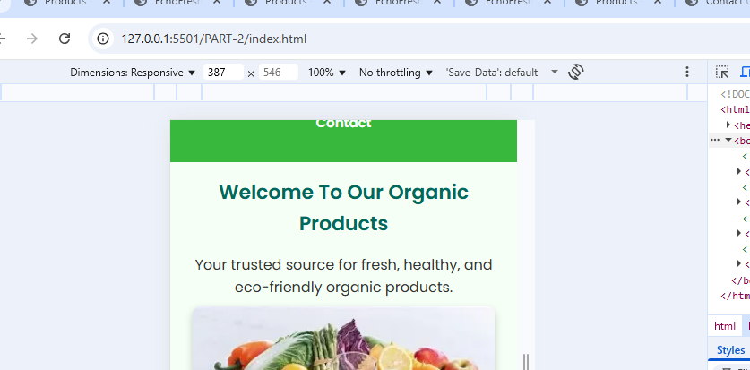
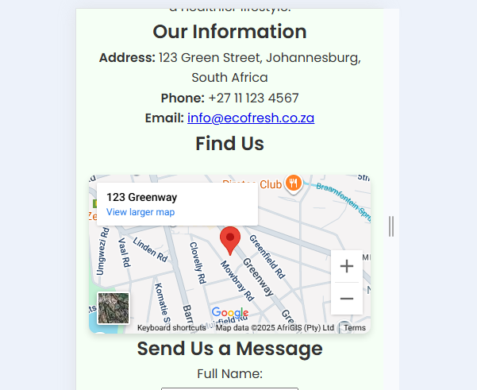
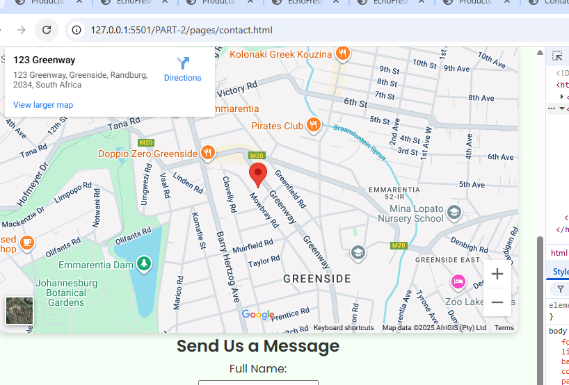
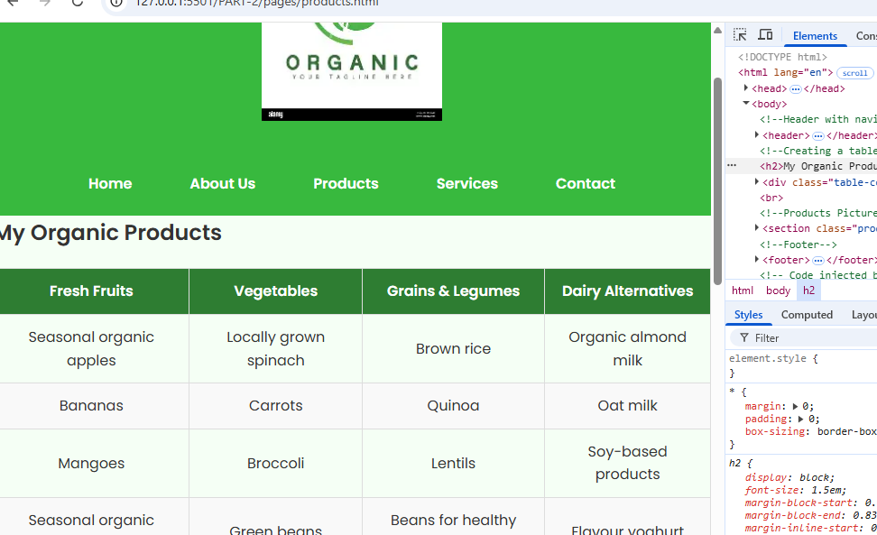

# MY WORK

---

## 🚀 Features

- **Home Page (index.html)** – Introduction to EcoFresh Organics.  
- **About Us (about.html)** – Company story, mission, values, and team.  
- **Products (products.html)** – Catalog of fruits, vegetables, grains, and dairy alternatives.  
- **Services (services.html)** – Details about delivery, eco-friendly packaging, workshops, and farmer support.  
- **Contact (contact.html)** – Contact info, map, and message form.  

---

## 🎨 Styling

All pages share a common stylesheet `css/style.css` which includes:

- Green eco-friendly color theme 🌿  
- Centered navigation bar  
- Responsive images  
- Consistent header and footer  

---

## 🛠️ How to Run

1. Download or clone this project.  
2. Open the folder in **Visual Studio Code** or your preferred editor.  
3. Open `index.html` in your browser to view the homepage.  
4. Navigate between pages using the menu links.

---

## 📌 Notes

- Replace placeholder images (`farm.jpg`, `fruits.jpg`, etc.) with your own images.  
- Update the **Google Maps embed link** in `contact.html` with your location.  
- The form in `contact.html` is static — to make it functional, you’ll need backend code (PHP, Node.js, etc.) or a form service.  

---

## 👤 Author

**Lukhwareni Thendo Theophilus**  
Web Development Project – 2025  

## PART2
🌱 EcoFresh Organics Website

This is the official repository for the EcoFresh Organics Website. It is a multi-page, responsive website built with HTML and CSS, designed to showcase organic products and services while ensuring accessibility on phones, tablets, and PCs.
Here’s a clean **Part 2 README.md** you can add to your project to explain the new updates with CSS and responsiveness:

---

# 📘 EcoFresh Organics Website – Part 2 Update

This is **Part 2** of the EcoFresh Organics website project. In this update, I added **CSS styling** and made several improvements to make the site modern, user-friendly, and responsive across **phones, tablets, and PCs**.

---

## 🔹 Changes Made

### 1. Added Global CSS (`Style.css`)

* Introduced a **consistent design** for all 5 pages (Home, About, Products, Services, Contact).
* Applied a **modern Google Font** for better readability.
* Styled navigation (navbar) for better visibility.
* Centered and styled the footer.

### 2. Responsive Design

* Website now **adapts to all devices** (phone, tablet, laptop).
* Images now scale properly using `.responsive-img`.
* Navigation links remain **easy to spot** on all screens.

### 3. Social Media Icons

* Added **Font Awesome** icons for Facebook, WhatsApp, Twitter (X), and YouTube in the footer.

### 4. Product Table Improvements

* Converted product table into a **responsive table** that scrolls horizontally on small screens.
* Styled table with hover effects, zebra striping, and custom header colors.

### 5. Responsive Google Map

* Embedded Google Maps on the Contact page is now **responsive** (auto resizes for all devices).

---

## 🔹 How to Use

1. **Clone or Download** this repository to your computer.
2. Ensure the folder structure is correct:

   ```
   index.html
   /pages (About.html, products.html, services.html, contact.html)
   /css (Style.css)
   /assests (logo.webp, images)
   ```
3. Open `index.html` in any browser (Chrome, Edge, Firefox).
4. Use the **navigation bar** to browse the pages.

   * Home → Welcome page
   * About Us → Company story, mission, values, and team
   * Products → Organic product categories (table + images)
   * Services → Delivery, Packaging, Workshops, Farmer Support
   * Contact → Contact info, map, and contact form

---

## 🔹 Next Steps (Optional Enhancements)

* Convert product table into **grid-style product cards**.
* Add **form validation** to the Contact form.
* Improve **mobile navbar (hamburger menu)** for smaller devices.

---

✅ With this update, EcoFresh Organics website is **styled, responsive, and mobile-friendly**.

Got it 👍 Since you used **W3Schools** for coding references and **ChatGPT** for guidance, here’s how your **reference list** would look in **APA 7th edition style**:


# 🌿 EcoFresh Organics Website – Final Project (Part 3)

**Author:** *Lukhwareni Thendo Theophilus*  
**Year:** 2025  
**Project:** Web Development Practical Assessment  

---

## 🚀 Overview

The **EcoFresh Organics Website** is a modern, multi-page, and fully responsive website that promotes organic products and sustainable living.  
Built using **HTML**, **CSS**, and **JavaScript**, this project demonstrates interactivity, responsiveness, and SEO-friendly web design.

---

## 📄 Pages Included

| Page | Description |
|------|--------------|
| **Home (`index.html`)** | Introduction to EcoFresh Organics and navigation to all sections. |
| **About Us (`about.html`)** | Details about the company’s story, mission, values, and team, with JS accordions. |
| **Products (`products.html`)** | Displays organic product categories in a vertical layout with a responsive table inside a styled card. |
| **Services (`services.html`)** | Outlines eco-friendly services like delivery, workshops, and packaging. |
| **Order (`order.html`)** | Allows customers to place online orders with JavaScript form validation. |
| **Enquiry (`enquiry.html`)** | Includes a functional enquiry form with validation and a thank-you message. |
| **Contact (`contact.html`)** | Provides contact information, social media links, and a responsive Google Map. |

---

## ✨ Features and Functionality

### 🌱 JavaScript Enhancements

- **Accordions** on the *About Us* page for “Our Story,” “Mission,” “Values,” and “Team.” 
- **Dark Mode Toggle** – Allows users to switch between light and dark themes dynamically.  
- **Order Form Validation** – Ensures all inputs (name, product, quantity, contact) are filled correctly.  
- **Enquiry Form Validation** – Checks required fields and displays confirmation messages.  
- **Auto Date/Time Greeting** – Displays dynamic greetings such as “Good morning, customer!” 
- **Navigation Interactivity** – Smooth scroll and menu highlighting for active pages.  

---

## 🎨 Styling and Responsiveness

- Unified **dark-black theme** for better contrast and accessibility.  
- Clean and readable **Google Fonts** typography.  
- Tables wrapped inside **card-like containers** with hover effects and shadows.  
- Responsive design using **flexbox** and **media queries** for mobile, tablet, and desktop devices.  
- Animated **background effects** to give the site a lively and modern appearance.  

---

## ⚙️ How to Run

1. **Download or Clone** this repository:  
   ```bash
   git clone https://github.com/<your->/EcoFresh-Organics.git

---

## 📚 Reference List


* W3Schools. (n.d.). *HTML Tutorial*. W3Schools. Retrieved September 16, 2025, from [https://www.w3schools.com/html/](https://www.w3schools.com/html/)

* W3Schools. (n.d.). *CSS Tutorial*. W3Schools. Retrieved September 16, 2025, from [https://www.w3schools.com/css/](https://www.w3schools.com/css/)

* W3Schools. (n.d.). *CSS Responsive*. W3Schools. Retrieved September 16, 2025, from [https://www.w3schools.com/css/css\_rwd\_intro.asp](https://www.w3schools.com/css/css_rwd_intro.asp)

* W3Schools. (n.d.). *HTML Responsive Web Design*. W3Schools. Retrieved September 16, 2025, from [https://www.w3schools.com/html/html\_responsive.asp](https://www.w3schools.com/html/html_responsive.asp)

* W3Schools. (n.d.). *CSS Flexbox*. W3Schools. Retrieved September 16, 2025, from [https://www.w3schools.com/css/css3\_flexbox.asp](https://www.w3schools.com/css/css3_flexbox.asp)

* OpenAI. (2025). *ChatGPT (Version GPT-5) \[Large language model]*. OpenAI. Retrieved September 16, 2025, from [https://chat.openai.com/](https://chat.openai.com/)





